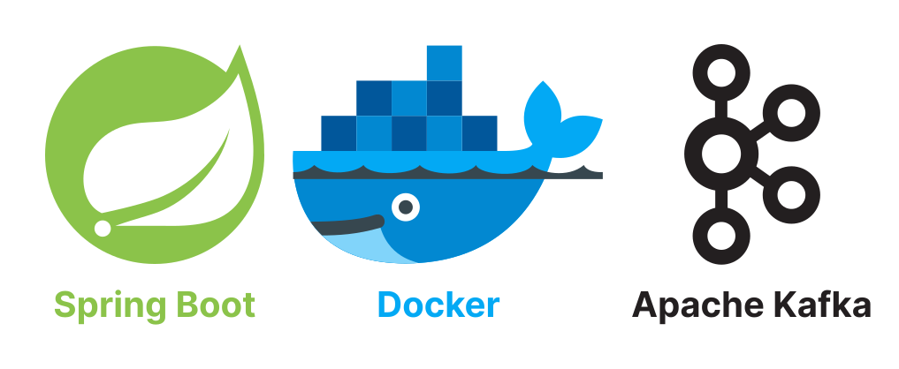

# Java Spring Boot + Apache Kafka



This repository demonstrates the implementation of Apache Kafka with the latest version of Java Spring Boot.

# 0. Technologies used

| Technology       | Version             |
|------------------|---------------------|
| Java Spring Boot | `v3.1.4`            |
| Docker           | `v24.0.6`           |
| Docker Compose   | `v2.21.0-desktop.1` |

# 1. Start Docker Compose

First of all, run the Zookeeper and Kafka server via Docker Compose:

```shell
docker compose up -d
```

- **Note:** this has also started the `kafka-ui` server which can be opened at http://localhost:8090/.

# 2. Imperative Commands

Test the Kafka server imperatively.

## 2.1. Create a Topic

Create a topic named `example-topic`:

```shell
docker exec -it kafka-server \
kafka-topics --create --topic example-topic \
--bootstrap-server localhost:9092
```

- Open http://localhost:8090/ui/clusters/local/all-topics and verify that the topic has been created.

## 2.2. Create a Producer

Create a producer and attach it to the previously created topic `example-topic`:

```shell
docker exec -it kafka-server \
kafka-console-producer --topic example-topic \
--bootstrap-server localhost:9092
```

- Now add some messages to emit to the attached topic:

```shell
>hello world
>kafka topic event
>foo
>bar
```

- Verify that these messages have been added in the `example-topic`: http://localhost:8090/ui/clusters/local/all-topics/example-topic/messages.

## 2.3. Create a Consumer

Create a consumer to listen on topic `example-topic` for any new messages that occur in real-time:

```shell
docker exec -it kafka-server \
kafka-console-consumer --topic example-topic --from-beginning \
--bootstrap-server localhost:9092
```

- Add a new message from the producer and watch the consumer get updated in real-time:

```shell
>sample message
```

# 3. Test the API

## 3.1. [GET] /api/v1/messages/publish?message={string}

Send a new message to the Kafka topic through the Spring Boot API:

```shell
curl "http://localhost:8080/api/v1/messages/publish?message=hello%20world"
```

- To watch the topic get updated in real-time, run command:

```shell
docker exec -it kafka-server \
kafka-console-consumer --topic foobar-topic --from-beginning \
--bootstrap-server localhost:9092
```

- Or simply observe it on the Kafka UI: http://localhost:8090/ui/clusters/local/all-topics/foobar-topic/messages.
